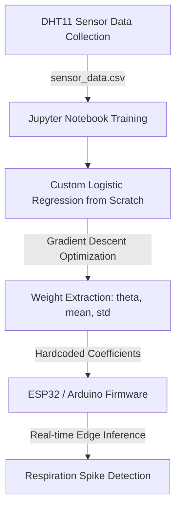

# TinyML Temperature & Humidity Respiration Spike Detector

An end-to-end, lightweight TinyML implementation of a custom Logistic Regression classifier trained from scratch in Python and deployed on an ESP32/Arduino microcontroller. This project uses DHT11 sensor readings to detect respiration spike events locally at the edge.

## Architecture & Workflow



## Repository Structure

- **[Humidty_sesnor_tiny_ml.ino](file:///C:/Users/usman/Desktop/VSCODE/Python/Temperature_sensor_tiny_ml/Humidty_sesnor_tiny_ml.ino)**: Arduino/ESP32 sketch containing the inference code, sigmoid function, data scaling logic, and hardcoded weights.
- **[Tiny_ml_training_code.ipynb](file:///C:/Users/usman/Desktop/VSCODE/Python/Temperature_sensor_tiny_ml/Tiny_ml_training_code.ipynb)**: Jupyter Notebook for data preprocessing, normalization, manual logistic regression training, and accuracy verification.
- **[sensor_data.csv](file:///C:/Users/usman/Desktop/VSCODE/Python/Temperature_sensor_tiny_ml/sensor_data.csv)**: Training dataset containing temperature and humidity readings.

---

## 1. Offline Model Training (Python)

The model is trained using a manual implementation of **Logistic Regression** (no `scikit-learn` for the training loop, only using native NumPy matrix operations and Gradient Descent).

### Key Pipeline Steps:
1. **Target Labelling**: Generates binary targets based on the humidity threshold:

$$
\text{Target} = \begin{cases} 
1 & \text{if humidity} > 55.0 \\ 
0 & \text{otherwise} 
\end{cases}
$$

2. **Feature Scaling (Z-Score Normalization)**:

$$
X_{\text{scaled}} = \frac{X - \mu}{\sigma}
$$

   - **Temperature**: $\mu = 35.9054$, $\sigma = 0.6874$
   - **Humidity**: $\mu = 58.1153$, $\sigma = 19.9401$
3. **Model Weights ($\theta$)**: Learns coefficients using Gradient Descent over 3000 iterations ($\alpha = 0.1$).
   - Learnt Weights: `[0.984221, -0.062587, 6.727087]` (Intercept, Temperature Coefficient, Humidity Coefficient).

---

## 2. On-Device Edge Inference (Arduino/ESP32)

The learned parameters are embedded directly into the C++ code to run predictions on-device.

### Inference Pipeline:
1. **Read Sensor**: Reads ambient temperature ($T$) and humidity ($H$) from the DHT11 sensor.
2. **Scale Inputs**: Normalizes the readings using the training statistics:
   ```cpp
   float scaled_temp = (temp - mean_temp) / std_temp;
   float scaled_humid = (humid - mean_humid) / std_humid;
   ```
3. **Compute Log-Odds**:
   ```cpp
   float z = (1.0 * theta[0]) + (scaled_temp * theta[1]) + (scaled_humid * theta[2]);
   ```
4. **Apply Sigmoid Function**:
   ```cpp
   float sigmoid(float z) {
     return 1.0 / (1.0 + exp(-z));
   }
   ```
5. **Classify**: If the probability is $\ge 0.5$, it flags a **Respiration Spike Event** via Serial output.

---

## Getting Started

### Prerequisites
- **Python 3.8+** with `numpy`, `pandas`, `matplotlib`, and `scikit-learn`.
- **Arduino IDE** or **VS Code with PlatformIO** for uploading firmware.
- **Hardware**: ESP32 or compatible Arduino board + DHT11 Sensor.

### Pinout Connections
| DHT11 Pin | Arduino/ESP32 Pin |
|---|---|
| VCC | 3.3V / 5V |
| GND | GND |
| DATA | GPIO 4 |

---

## License

This project is open-source and available under the MIT License.
